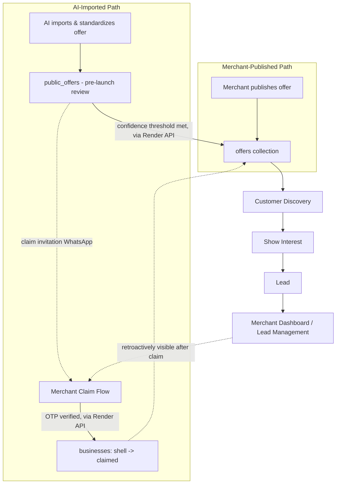
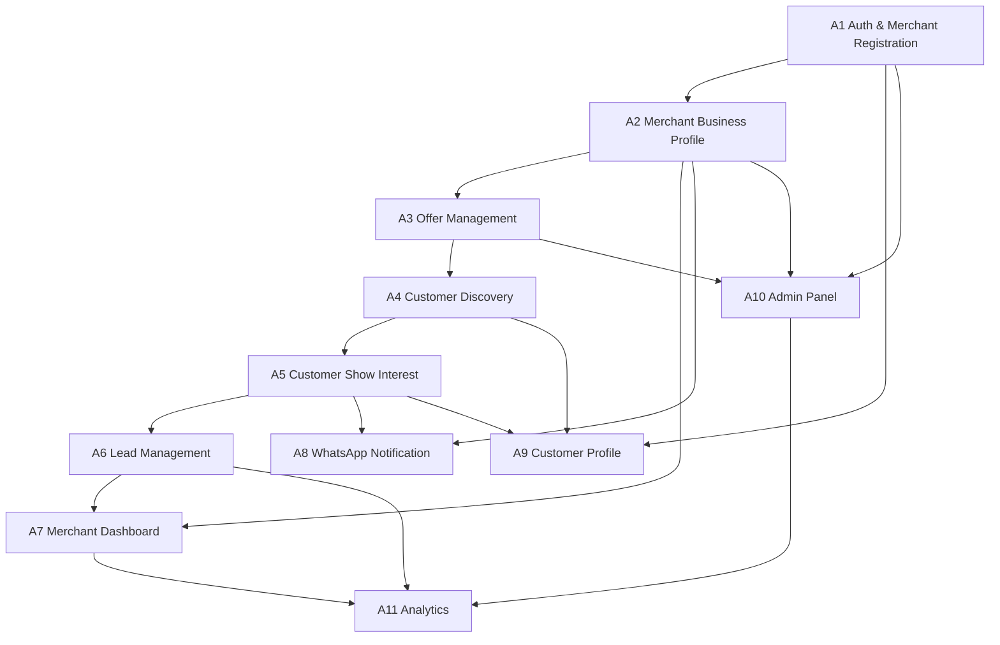
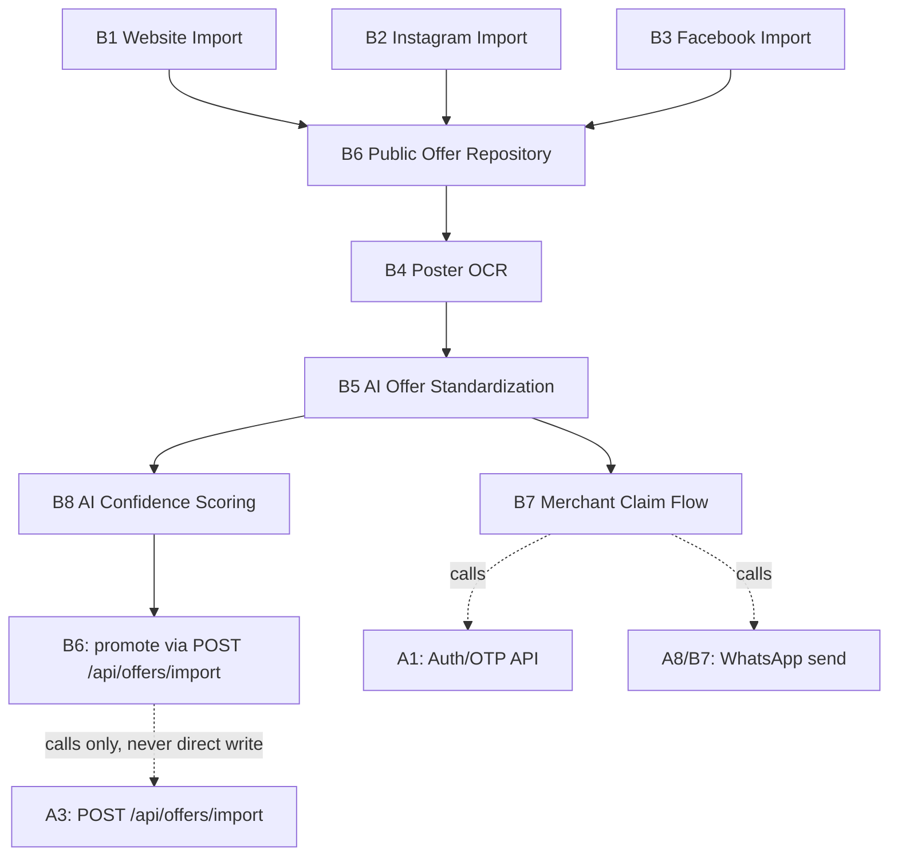

# Pairley — Technical Implementation Plan

_Generated 2026-07-18, last revised 2026-07-18. Companion to [ROADMAP.md](./ROADMAP.md), [ROADMAP_AUDIT.md](./ROADMAP_AUDIT.md), and [MIGRATION_PLAN.md](./MIGRATION_PLAN.md). Planning document only — no code, no migrations, nothing implemented yet._

> **Revision note (this version):** AI-assisted Public Offer Discovery is no longer a Phase 2 / post-launch feature. It is now part of the MVP, because a marketplace with zero merchant-published offers at launch has nothing for customers to discover. All modules are re-grouped below into **Group A** (marketplace foundation), **Group B** (AI offer discovery — now mandatory pre-launch), and **Group C** (AI intelligence features — the only group still postponed to post-launch).

## Architecture (unchanged, reconfirmed)

| Layer | Technology |
|---|---|
| Frontend | React + Capacitor |
| Authentication | Firebase Auth |
| Database | Firestore |
| Storage | Firebase Storage |
| Backend / business logic | Existing Render Node.js backend (`pairley-backend2026.onrender.com`) — not replaced |
| Notifications (WhatsApp) | Server-side only, from the Render backend |
| Analytics | Firestore (aggregated by the Render backend) |
| AI Engine | **Independent service** — mandatory pre-launch (Group B), never writes directly to production `offers`/`leads`, always communicates through Render backend APIs |

No Cloud Functions layer. No change to hosting. The one addition this revision makes explicit: the AI Engine is now a **launch-blocking** independent service, not a future add-on — but the isolation rule from the previous draft still holds and is, if anything, more important now: **the AI Engine must never write directly to production `offers` or `leads`. It always calls the Render backend's own APIs to do so** — the same APIs the frontend uses, enforcing the same validation.

---

## MVP Structure: Three Groups

| Group | Name | Status | Modules |
|---|---|---|---|
| **A** | Marketplace Foundation | Mandatory for launch | 11 |
| **B** | AI Offer Discovery Engine | Mandatory for launch | 8 |
| **C** | AI Intelligence Features | Postponed — post-launch | 3 |

**Groups A and B together are the Pairley MVP.** They are built together, not sequentially — Group B has almost no value without Group A to publish into, and Group A launches with a thin marketplace without Group B seeding it with real content. Group C (offer generation from posters, demand prediction, conversational assistants) is the only work postponed.

### Why Group A still comes first in the reading order below
Group B's entire job is to produce content that lands inside Group A's data model (`offers`, `businesses`, `leads`). Group A's core schema (Module A3: Offer Management) has to exist, even in skeleton form, before Group B has anywhere to write to via the Render API. In practice this means: **start both tracks on day one**, with Group A's early modules (A1 Auth, A2 Business Profile, A3 Offer Management) prioritized within the first 2–3 weeks so Group B has a real API surface to integrate against instead of building against a moving target.

---

## Cross-Group Integration Points

This is the part that makes "developed together" concrete rather than aspirational — four specific places where Group A and Group B touch:

1. **Promotion path.** Group B never writes to `offers`, `businesses`, or `leads` directly. When an AI-imported offer clears its confidence threshold, Group B calls a Render endpoint (`POST /api/offers/import`, built as part of A3/B6) that creates the real `offers` doc and, if needed, an **unclaimed "shell" business record** in `businesses` (status `UNCLAIMED`, no Firebase Auth uid attached yet, contact info taken from the scraped source). This is the same enforcement pattern as the previous draft's isolation guarantee, just now doing real write-through work instead of a hypothetical.
2. **Leads against unclaimed businesses.** A customer can show interest in an AI-imported offer exactly like any other (Module A5/A6) — the lead is stored against the shell business's `businessId` like normal. Nothing about lead capture cares whether the owning business is claimed yet.
3. **Two different WhatsApp flows, one credential boundary.** Module A8 (WhatsApp Notification) sends lead alerts to **verified, opted-in** merchant numbers — that flow is unchanged. Module B7 (Merchant Claim Flow) sends a **cold outreach** message to the contact number scraped from the public source (the business hasn't opted into Pairley yet) — e.g. *"42 customers are interested in your offer on Pairley — claim your free account to respond to them."* Both flows are implemented inside the Render backend and share the same WhatsApp provider credential; they use different, separately-approved message templates, because unsolicited business-initiated outreach to a non-opted-in number is a materially different (and more compliance-sensitive) case than notifying an onboarded merchant. See **Group B Risks & Compliance** below.
4. **Claim reconciles everything retroactively.** When the real merchant completes OTP verification (B7), the shell `businesses` doc is linked to their Firebase uid, its `offers` flip from `AI_IMPORTED` to `MERCHANT_VERIFIED`, and — critically — **any leads captured before the claim are already sitting there** waiting in Module A6 (Lead Management) the moment the merchant logs in. Nothing is backfilled or migrated at claim time; the data was real all along, just not yet visible to an authenticated owner.

---

## ⚠️ Decision Needed Before Group B Build Starts: Pre-Claim Visibility

Your instructions contain two statements that point in different directions, and this needs a explicit answer before Modules B6/B7/B8 are built, because it changes what gets shown to customers on day one:

- **Statement suggesting pre-claim visibility:** *"Customer should NOT know whether an offer was Merchant Published or AI Imported... Only an optional badge should indicate Verified Merchant or Imported from Public Information."* — this implies an AI-imported, **not-yet-claimed** offer can already be live in customer discovery, badged "Imported from Public Information."
- **Statement suggesting claim-gated visibility:** the System Flow diagram shows `AI Imported Offer → Public Offer Repository → Merchant Claim → Offer Repository → Customer Discovery` — Merchant Claim sits **before** the offer reaches the customer-facing repository, implying nothing AI-imported is customer-visible until a real merchant claims it.

These can't both be true for the same offer. **This plan defaults to the first reading (pre-claim visibility for high-confidence offers, badged accordingly)**, because the stated rationale for making Group B launch-mandatory — *"a marketplace without offers has no value to customers"* — only holds if AI-imported offers actually appear before anyone claims them. A claim-gated model would mean zero customer-visible inventory until the first merchant claims something, which doesn't solve the cold-start problem this group exists to solve.

Under the default: only `public_offers` entries that clear a high-confidence auto-approval threshold get promoted into customer-visible `offers` pre-claim (badged "Imported from Public Information"); lower-confidence entries stay in admin review and are never customer-visible until a human approves or a merchant claims them. Every promoted, unclaimed offer remains instantly unpublishable by an admin (a takedown switch), given the compliance risks below.

**If the claim-gated reading is actually what's intended, say so before Group B implementation starts** — it changes B6/B7/B8 meaningfully (repository becomes an admin-only staging area with no customer-facing promotion path until claim), and is a smaller, lower-risk build.

---

## Group A: Marketplace Foundation

11 modules. (Your list named 10; **Customer Profile** is added as an 11th — it isn't in your named list, but it's the same module from the prior draft that fixes the audit-flagged bug where "Save Offer" doesn't persist, and every discovery/interest screen in this group assumes a customer identity to save against. Flagging it explicitly rather than silently keeping it.)

### Group A Module Sequence & Effort Summary

| # | Module | Est. Days | Hard Dependencies |
|---|---|---|---|
| A1 | Authentication & Merchant Registration | 4–5 | None (foundational) |
| A2 | Merchant Business Profile | 3–4 | A1 |
| A3 | Offer Management | 5–7 | A2 |
| A4 | Customer Discovery | 4–5 | A3 |
| A5 | Customer Show Interest | 3–4 | A3, A4 |
| A6 | Lead Management | 2–3 | A5 |
| A7 | Merchant Dashboard | 2–3 | A6, A2 |
| A8 | WhatsApp Notification | 5–7 + 3–10 external wait | A5, A2 |
| A9 | Customer Profile | 3 | A1, A4, A5 |
| A10 | Admin Panel | 5–6 | A1, A2, A3 |
| A11 | Analytics | 4–5 | A6, A7, A10 |

**Group A total: ~46–55 dev-days (≈9–11 weeks, one developer).**

---

### Module A1 — Authentication & Merchant Registration

> **Status: ✅ COMPLETE** — Tag: `pairley-module1-complete`
> — **Database:** migration `20260718173010_module1_identity_foundation` applied and verified against production.
> — **Application Code:** deployed to production (backend + frontend) and re-verified with a second smoke test against the live deployed code: random OTP generation, bypass removal, `business_name` validation, `business_status`/`source` assignment, JWT auth, merchant/customer registration and login, admin login, and the KYC-preview auth guard (401/403) all confirmed working.
> — **Known unrelated issue:** KYC document *retrieval* (not the auth guard, which is verified) is currently blocked by a pre-existing AWS credential compromise (`AWSCompromisedKeyQuarantineV3`) found during verification — needs credential rotation, tracked separately, does not block this module.

**Objective:** Unified identity for customers, merchants, and admins using Firebase Auth for token issuance, with the Render backend as the authority that creates profile records and assigns roles. Removes the hardcoded `123456` OTP bypass flagged in the audit.

**UI Screens:** Sign Up (role tabs) — `SignUpPage.jsx` rebuild using Firebase's phone-OTP SDK; Login; OTP step (`OtpInput.jsx`); Merchant KYC Onboarding Wizard (`KycOnboardingWizard.jsx`).

**Backend APIs (Render Node.js):** `POST /api/auth/register`, `POST /api/auth/kyc`, `GET /api/auth/me`.

**Firestore Collections:** `customers/{uid}`, `businesses/{uid}` (status: `PENDING_APPROVAL`|`APPROVED`|`REJECTED`|`UNCLAIMED` — the `UNCLAIMED` state is new in this revision, used only by Group B's shell businesses), `businessKycDocs/{uid}`.

**Firebase Functions:** None. Render performs Firebase ID token verification, Firestore writes, and `setCustomUserClaims` inline via the Admin SDK.

**WhatsApp Integration:** None here (Module A8).

**Database Changes:** Firestore rules deny direct client read/write on `customers`/`businesses`/`businessKycDocs` (backend-write-only via the Admin SDK credential); remove the `/auth/send-otp` / `/auth/verify-otp` endpoints and the hardcoded bypass UI copy.

**Estimated Development Time:** 4–5 days

**Dependencies:** None — first module. Requires Firebase Phone Auth enabled, Android SHA keys registered, a service-account credential issued to Render.

**Testing Checklist:**
- [ ] Customer/business signup via phone OTP creates the correct Firestore doc and status
- [ ] Google Sign-In continues to work for customers
- [ ] Custom claims correctly reflect role after registration
- [ ] KYC upload + submission works end-to-end
- [ ] No hardcoded OTP bypass anywhere in production
- [ ] Requests with missing/invalid Firebase ID tokens are rejected with 401

**Completion Criteria:** A merchant can register, verify by real OTP, submit KYC, and reach `PENDING_APPROVAL`; a customer can register via phone or Google and reach discovery; role is enforced server-side.

---

### Module A2 — Merchant Business Profile

> **Status: ✅ COMPLETE** — Tag: `pairley-module2-complete`
> — **Database:** migration `20260719054640_module2_business_profile` applied and verified against production.
> — **Application Code:** deployed to production (backend + frontend) and verified via smoke test: profile view/update, logo/cover/gallery upload+delete, description/website/social links, location, per-day store hours, Lead Acceptance mode, profile completion calculation, admin business listing, customer offer browsing — all confirmed working.
> — **Found and fixed during verification:** email uniqueness on `PUT /business/profile` only checked the `Business` table, allowing a collision with an `Admin`/`Customer` email — now checks all three. See [CHANGELOG.md](./CHANGELOG.md).

**Objective:** Let an approved merchant manage their storefront — details, gallery, per-day hours, location.

**UI Screens:** Business Settings rebuild; Gallery management (new); Store Timing editor (new, per-day); Location picker.

**Backend APIs (Render Node.js):** `GET/PUT /api/business/profile`, `POST/DELETE /api/business/gallery`, `PUT /api/business/store-timing`.

**Firestore Collections:** `businesses/{businessId}` extended — `gallery[]`, `storeTiming{}`, `address`, `geo`, `geohash`, `category`.

**Firebase Functions:** None — inline in the Render endpoints, ownership-checked against the caller's custom claim `businessId`.

**WhatsApp Integration:** None.

**Database Changes:** Composite index for geohash-range queries (`geofire-common`); Storage rules for `/businesses/{businessId}/gallery/*`.

**Estimated Development Time:** 3–4 days

**Dependencies:** A1

**Testing Checklist:**
- [ ] Profile edits persist; gallery upload/delete works with limits
- [ ] Per-day store timing, including closed days, saves correctly
- [ ] Location picker updates geo/geohash correctly
- [ ] A second merchant's token is rejected with 403 on another business's profile

**Completion Criteria:** An approved merchant has a complete, publicly viewable storefront ready for offers and discovery to render against.

---

### Module A3 — Offer Management

> **Status: ✅ COMPLETE** — Tag: `pairley-module3-complete`
> — **Database:** migration `20260719085657_module3_offer_management_schema` applied via `prisma db push` (same non-migration-tracked workflow as Modules 1–2) and verified against production — 2 enum extensions (11 new `OfferType` values, `PAUSED`/`ARCHIVED` added to `OfferStatus`), 13 new nullable/defaulted columns on `offers`, new `offer_versions` table, one-time media backfill. Zero data loss: offer/business/customer/lead/interest counts identical before and after.
> — **Application Code:** deployed to production (backend + frontend) and verified with a full production smoke test using disposable test accounts — merchant offer creation across 5 types (Standard, BOGO, Percentage Discount, Combo, legacy Group), edit, pause/resume, archive, cover+gallery image upload, location update; customer Show Interest on Standard/Pair/Group offers (confirmed legacy types still create `OfferInterest` + capacity tracking, new types correctly skip it — Lead-only); the hourly expiry scheduler (confirmed live in production, already auto-expired 7 real offers past `end_date` before this smoke test ran); full `OfferVersion` audit trail (CREATED → MERCHANT_EDIT → STATUS_CHANGE ×2 → ARCHIVED, one snapshot per action); and a public-API field-exposure fix (`GET /offers/list`/`GET /offers/details/:id` were returning every Pairley 2.0 provenance field — `confidence_score`/`source`/`review_required`/etc. — to any anonymous caller; now whitelisted to only the fields actually used).
> — **Deviation from this spec:** this module was actually built against the real production Node.js/Prisma/PostgreSQL backend (not Firestore) per the architecture decision made before Module 1 started — see the note at the top of this document. `offerSource` is the existing `source` field (reused, not new); there is no `POST /api/offers/import` yet (belongs to Group B). The offer-type work went further than this spec: 17 total `OfferType` values (not just STANDARD/BOGO/GROUP), a shared `src/utils/offerTypes.js` frontend helper, and `CreateDealPage.jsx` now defaults to Standard with Pair/Group demoted to an opt-in "Advanced: Legacy Matching Type" section.
> — **Known gap, deferred:** `BusinessOrdersPage.jsx` only surfaces customers via `OfferInterest`, which is legacy-only — merchants using the new Standard/Lead flow have no dedicated "Leads" view yet. Not part of this module's scope; flagged for a future module.

**Objective:** Rebuild offer CRUD around `offer_type` (`STANDARD` default, `BOGO`/`PAIR`/`GROUP` optional) — and, new in this revision, make the schema aware that an offer can originate from a merchant **or** be promoted in by Group B, via a shared `offerSource` field.

**UI Screens:** Create Offer rebuild (Standard default + Advanced offer-type toggle); Manage Offers (completing the audit-flagged partial edit flow); offer preview.

**Backend APIs (Render Node.js):** `POST /api/offers/create`, `PUT /api/offers/:id`, `DELETE /api/offers/:id`, `PATCH /api/offers/:id/status`, `GET /api/offers/list`, `GET /api/offers/details/:id`, and **new:** `POST /api/offers/import` — the only entry point Group B is allowed to call to create a customer-facing offer from a `public_offers` entry (creates the `offers` doc and, if needed, an `UNCLAIMED` shell `businesses` doc, in one transaction).

**Firestore Collections:** `offers/{offerId}` — adds `offerSource: MERCHANT | AI_IMPORTED`, `verificationStatus: MERCHANT_VERIFIED | UNVERIFIED`, plus the existing `offer_type`, pricing, validity, images, `businessId`, denormalized `businessName`/`geo`/`geohash`, `status`. `categories/{categoryId}`.

**Firebase Functions:** None. `POST /api/offers/import` is the write-through boundary Group B calls — it performs the same validation as `POST /api/offers/create`, just with a different origin field set.

**WhatsApp Integration:** None directly.

**Database Changes:** New `offerSource`/`verificationStatus` fields (default `MERCHANT`/`MERCHANT_VERIFIED` for anything created the normal way); `offer_type` field as before; composite indexes on `(status, geohash)` and `(status, category, geohash)`; Firestore rules restrict all writes to the backend's Admin SDK credential, including the new import path (only callable with an internal Group B service token, not a customer/merchant token).

**Estimated Development Time:** 5–7 days

**Dependencies:** A2

**Testing Checklist:**
- [ ] Standard offer creation requires no pairing fields; BOGO/Pair/Group still work
- [ ] Edit offer fully round-trips every field
- [ ] `POST /api/offers/import` correctly creates an offer + shell business, and rejects calls not carrying the internal Group B service credential
- [ ] `offerSource`/`verificationStatus` render correctly on every offer regardless of origin

**Completion Criteria:** A merchant can publish a Standard offer in under a minute; Group B can promote an AI-imported offer into the exact same collection through one controlled endpoint, indistinguishable in structure from a merchant-created one except for its origin fields.

---

### Module A4 — Customer Discovery

> **Status: ✅ COMPLETE** — Tag: `pairley-module4-complete`
> — **Database:** migration `20260720000000_module4_geo_index` (one additive `(geo_lat, geo_lng)` index on `offers`) applied via `prisma db push` and verified against production — zero data loss, all record counts (offers/businesses/customers/leads/interests/versions) identical before and after.
> — **Application Code:** deployed to production (backend + frontend) and verified with a full production smoke test using disposable test accounts and real-coordinate test offers (Bangalore/Chennai) — server-side geo/radius filtering (50km radius correctly excluded a ~290km-away offer; unbounded radius returned both, correctly nearest-first sorted), category filtering + validation (unknown category → 400) + real category counts, `SearchOverlay` wired to the live backend, offer-type/origin badge rendering (computed server-side, verified `null` for a plain manual offer), real "Similar Deals," the full merchant offer lifecycle (create/edit/pause/resume/archive) including geo-tagged offers, Show Interest, owner-only access to non-active offer details (401/404 confirmed for non-owners, 200 for the owner), `status=ALL` lockdown to authenticated callers, the `PUT admin/offers/:id/exclusive` dormant toggle (guard-verified via API — 401 unauthenticated/403 non-admin — and exercised successfully by the user as real admin), and response-time sanity checks (all well under 1.5s).
> — **Standalone security fix, shipped ahead of this module:** `GET /offers/details/:id` was fully unauthenticated and returned every interested customer's name/mobile/email/address to any caller who knew/guessed an offer id — confirmed live against a real production offer before the fix, patched and verified the same day per the "security fixes never wait for feature modules" rule.
> — **Deviation from this spec:** built against the real production Node.js/Prisma/PostgreSQL backend (not Firestore/Firebase Functions), per the architecture decision made before Module 1. The badge text in production is "Verified Merchant" / "Pairley Exclusive" / "Imported from Public Information" (three states, fixed priority in that order) rather than the two states drafted here — matching Module 3's approved customer-experience decision. `is_pairley_exclusive` toggle support shipped but stays admin-API-only/dormant until a future admin-tools module adds a UI button for it.

**Objective:** Let customers find nearby, relevant offers — regardless of origin, per the "customer should not know" rule — with an optional badge as the only visible distinction.

**UI Screens:** Discovery feed, offer detail, category/location filters. `DealCard`/`DealDetailPage` render a small badge — "Verified Merchant" or "Imported from Public Information" — driven by `verificationStatus`, otherwise identical treatment.

**Backend APIs (Render Node.js):** `GET /api/offers/list?lat=&lng=&radiusKm=&category=`, `GET /api/offers/details/:id` — both already return every field in Module A3's unified `offers` schema, so no special-casing is needed for AI-imported entries.

**Firestore Collections:** `offers` (read), `businesses` (read, incl. `UNCLAIMED` shells — a shell's public-facing fields, e.g. name/address, still need to render correctly in an offer detail page even without a logged-in owner).

**Firebase Functions:** None. Optional daily job (Render Cron/`node-cron`) to auto-close expired offers.

**WhatsApp Integration:** None.

**Database Changes:** None beyond A3's schema — this module is a read-path consumer.

**Estimated Development Time:** 4–5 days

**Dependencies:** A3

**Testing Checklist:**
- [ ] Nearby/category/radius filtering works correctly
- [ ] Offer detail renders correctly for both merchant-owned and shell-owned offers
- [ ] Badge shows correctly and never leaks any other origin detail (no "scraped from Instagram" text, no source URLs, to a customer)
- [ ] Closed/expired offers never appear

**Completion Criteria:** A customer browsing offers cannot tell, beyond the optional badge, whether an offer came from a merchant or from Group B.

---

### Module A5 — Customer Show Interest

**Objective:** Capture a customer's interest as a `Lead` and kick off notification — works identically whether the offer's business is claimed or an unclaimed shell.

**UI Screens:** "Show Interest" CTA (branches by `offer_type`, not by `offerSource` — origin is invisible here too); confirmation state; legacy matching-pool UI unchanged for `BOGO`/`PAIR`/`GROUP`.

**Backend APIs (Render Node.js):** `POST /api/leads/create` — validates the offer is `STANDARD` and `ACTIVE`, writes the lead, triggers Module A8's notification logic (which itself decides whether the owning business is verified/opted-in and can be messaged, or is a shell awaiting claim — see Module B7).

**Firestore Collections:** `leads/{leadId}` — `offerId`, `businessId`, `customerId`, `customerName`, `customerPhone`, `customerLocation`, `status: NEW`, `createdAt`.

**Firebase Functions:** None.

**WhatsApp Integration:** Triggers A8 (verified merchant) or defers to B7's claim-invitation logic (unclaimed shell) — decoupled from the API response either way.

**Database Changes:** New `leads` collection + composite index `(businessId, status, createdAt)`.

**Estimated Development Time:** 3–4 days

**Dependencies:** A3, A4

**Testing Checklist:**
- [ ] Exactly one lead per customer per offer, no duplicates
- [ ] Works identically for offers owned by a claimed business vs. an `UNCLAIMED` shell
- [ ] Confirmation UI is independent of downstream notification success/failure

**Completion Criteria:** Every "Show Interest" click reliably produces one lead, regardless of the offer's origin or claim status.

---

### Module A6 — Lead Management

> **Status: ✅ COMPLETE** — Tag: `pairley-module5-complete` (numbered Module 5 in delivery order — Module A5's core mechanic, capturing a `Lead` on Show Interest, was already built in Module 3, so this module is A6's merchant-side half).
> — **Database:** migration `20260720100000_module5_lead_management_schema` (converts `Lead.status` from free-text to a `LeadStatus` enum, adds `updated_at`, adds an index) applied via `prisma db push` and verified against production — zero data loss, all 7 existing leads correctly mapped `'Interested'` → `NEW`, all other record counts identical before and after. Caught and fixed a real deployment-time issue before any data was touched: `@updatedAt` alone doesn't provide a SQL-level default, so the first `db push` attempt correctly refused rather than fail against the existing rows; fixed with `@default(now()) @updatedAt` and re-applied successfully.
> — **Application Code:** deployed to production (backend + frontend) and verified with a full production smoke test using disposable test accounts (two merchants, one customer) — lead creation via Show Interest, the full status workflow (NEW → CONTACTED → CONVERTED, invalid status rejected), ownership enforcement (a second merchant correctly got 403 on both list-level and direct-fetch/status-update attempts on the first merchant's lead), filtering by status and offer, the new server-side lead notification (confirmed a real `Notification` row created), the "New Leads" dashboard stat, and regression coverage for Modules 3 and 4 (offer create/pause/resume/archive + version snapshots, legacy `OfferInterest` flow, PII protection, field-exposure discipline, `status=ALL` lockdown) — all passed with no regressions.
> — **Deviation from this spec:** built against the real production Node.js/Prisma/PostgreSQL backend, per the architecture decision made before Module 1 — `GET /leads?offerId=` covers both "all my leads" and "leads for one offer" without a separate `GET /offers/:id/leads` route (the `shop_id` scoping already present made the extra route redundant). No `UNCLAIMED` shell-business concept exists in this implementation (that belongs to Group B, not yet built), so the shell-related testing checklist items below don't apply yet.
> — **Also shipped:** server-side lead notification (DB `Notification` row + FCM push if a token exists) — previously a merchant's only signal was the customer's own browser opening `wa.me` popups, which produce nothing if the tab closes or the popups are blocked. A shared `src/utils/whatsapp.js` helper, extracted from `InterestButton.jsx`'s previously-duplicated inline logic. A copy-only disambiguation fix on `BusinessOrdersPage.jsx` (its pre-existing "Leads to Contact" tab is `OfferInterest`-based, not `Lead`-based — relabeled "Matches to Contact" now that a real Leads page exists).

**Objective:** A dedicated leads system — split out from the dashboard in this revision — because leads now need to support two distinct consumers: an already-logged-in merchant (normal case) and a merchant who hasn't claimed their business yet but whose accumulated lead count is what drives Module B7's claim invitation.

**UI Screens:** Interested Customers / Leads list (per-offer and all-leads), lead detail, status update (`New`/`Contacted`/`Converted`/`Not Interested`).

**Backend APIs (Render Node.js):** `GET /api/business/leads`, `GET /api/offers/:id/leads`, `PATCH /api/leads/:id/status`, and **new:** an internal `GET /api/internal/leads/count?businessId=` used only by Module B7 to decide when to send a claim invitation.

**Firestore Collections:** `leads` (read + status update, scoped by `businessId`), `offers` (read, for counts).

**Firebase Functions:** None.

**WhatsApp Integration:** "Contact Customer" merchant-initiated `wa.me` deep link, same as before.

**Database Changes:** None beyond A5's `leads` collection.

**Estimated Development Time:** 2–3 days

**Dependencies:** A5

**Testing Checklist:**
- [ ] Leads list filters correctly by offer/status
- [ ] Status updates persist immediately
- [ ] A merchant cannot fetch another business's leads (403)
- [ ] Leads accumulated against an `UNCLAIMED` shell are present and correctly counted, and become visible the moment that business is claimed — nothing is lost or needs backfilling

**Completion Criteria:** Every lead, regardless of when it was captured relative to a claim event, is visible to the right merchant the moment they're authenticated against that business.

---

### Module A7 — Merchant Dashboard

**Objective:** The merchant's operational home — stats and recent activity, linking into Module A6 for the leads detail work.

**UI Screens:** Dashboard home (stats cards, recent activity) — rebuild of `BusinessDashboard.jsx`.

**Backend APIs (Render Node.js):** `GET /api/business/dashboard` (counts: total leads, new leads today, active offers).

**Firestore Collections:** `leads`, `offers`, `businesses` (read, scoped).

**Firebase Functions:** None.

**WhatsApp Integration:** None directly (surfaced via A6).

**Database Changes:** None new.

**Estimated Development Time:** 2–3 days

**Dependencies:** A6, A2

**Testing Checklist:**
- [ ] Stats are accurate and update in near-real-time
- [ ] Dashboard correctly reflects state immediately after a business is claimed (Group B)

**Completion Criteria:** A merchant logging in immediately understands how their offers are performing without drilling into Lead Management first.

---

### Module A8 — WhatsApp Notification

**Objective:** Automated, server-side WhatsApp push to a **verified, opted-in** merchant the moment a new lead arrives. (The cold, non-opted-in outreach case for unclaimed businesses is Module B7 — same backend, different template and consent posture, kept as a separate module because the compliance requirements differ.)

**UI Screens:** Merchant Settings: "Lead Alert WhatsApp Number" field + verification/opt-in step; delivery status indicator in Module A6's leads list.

**Backend APIs (Render Node.js):** Internal send function invoked from `POST /api/leads/create` when the owning business is verified/claimed; `POST /api/business/whatsapp-number/verify`.

**Firestore Collections:** `whatsappLogs/{logId}`, `businesses.whatsappNumber`/`.whatsappVerified`.

**Firebase Functions:** None — lives entirely in the Render backend.

**WhatsApp Integration:** Provider account (Meta Cloud API, or Gupshup/AiSensy for faster India onboarding), pre-approved lead-alert template, delivery-status logging/retry.

**Database Changes:** New `whatsappLogs` collection + index; provider credentials in Render's secret store only.

**Estimated Development Time:** 5–7 dev-days **+ 3–10 days external approval wait, start Day 1**

**Dependencies:** A5, A2

**Testing Checklist:**
- [ ] Verified merchants get a message within seconds of a new lead
- [ ] Failed sends logged and retried
- [ ] Unverified/unclaimed businesses never receive this template (they get B7's separate template instead, or nothing)
- [ ] Lead capture succeeds even if this fails

**Completion Criteria:** Verified merchants are reliably notified in near real time, with this pipeline never blocking lead capture.

---

### Module A9 — Customer Profile

> **Status: ✅ COMPLETE** — Tag: `pairley-module6-complete` (numbered Module 6 in delivery order).
> — **Database:** migration `20260720120000_module6_customer_profile_notify_prefs` (3 additive boolean columns on `customers`, each with a `DEFAULT`) applied via `prisma db push` and verified against production — zero data loss, all record counts identical before and after.
> — **Application Code:** deployed to production (backend + frontend) and verified with a full production smoke test using disposable accounts (two customers, one merchant) — save/unsave an offer with real persistence confirmed across a fresh fetch (not just within a session), two-customer isolation on saved offers and profile updates, an archived offer staying visible in the saved list with the correct "No Longer Available" badge, real notification-preference persistence (previously `localStorage`-only), the `UpdateCustomerProfileDto` whitelist rejecting a non-whitelisted field live, and full regression coverage across Modules 3 (offer lifecycle + version history), 4 (discovery, category counts, PII protection), and 5 (lead creation/workflow/ownership, legacy `OfferInterest` compatibility) — all passed with no regressions.
> — **Finding, not a build-from-scratch:** the backend for this module (`GET/PUT customers/profile`, `GET/POST/DELETE customers/save-offer(s)`) already existed and worked — the actual gap was that `DealCard.jsx`'s wishlist button never called it (pure local state, reset on every reload) and the profile page's "Notifications" section only wrote to `localStorage`. Module 6 was a wiring/hardening pass, not new backend construction — smaller in scope than this section's original 3-day estimate.
> — **Deviation from this spec:** "Preferred Categories" stayed client-side/local per an explicit decision (no defined server-side purpose like recommendations yet, so no new column was added for it) rather than being "extended into `customers` schema" as originally drafted here.

**Objective:** Persistent customer identity — saved offers, notification preferences, interest history. Fixes the audit's unpersisted "Save Offer" bug.

**UI Screens:** Customer Profile, Saved Offers (persisted), "My Interests," notification preferences.

**Backend APIs (Render Node.js):** `POST/DELETE /api/customers/saved-offers/:offerId`, `PUT /api/customers/preferences`, `GET /api/customers/interests`.

**Firestore Collections:** `customers/{customerId}` extended with `savedOfferIds[]`, `categoryInterests[]`, `notificationPrefs{}`; `leads` (read, by customer).

**Firebase Functions:** None.

**WhatsApp Integration:** None.

**Database Changes:** Extend `customers` schema; index `leads` by `customerId`.

**Estimated Development Time:** 3 days

**Dependencies:** A1, A4, A5

**Testing Checklist:**
- [ ] Save/unsave persists across sessions and devices
- [ ] "My Interests" accurately reflects lead status, including for offers from AI-imported/shell businesses

**Completion Criteria:** Customer state persists reliably regardless of the underlying offer's origin.

---

### Module A10 — Admin Panel

**Objective:** Merchant approval, offer moderation, category management on the existing backend — plus, new in this revision, a takedown capability for AI-imported offers (needed because Group B can now put content live pre-claim).

**UI Screens:** Admin Dashboard rebuild; merchant approval queue + KYC review; offer moderation queue (now includes an "AI-Imported" filter/tag); category management (new); customer/merchant directories.

**Backend APIs (Render Node.js, admin-role-gated):** `PUT /api/admin/business/verify/:id`, `PUT /api/admin/offers/moderate/:id`, `POST/PUT/DELETE /api/admin/categories`, `GET /api/admin/customers`, `GET /api/admin/businesses`, and **new:** `POST /api/admin/offers/:id/takedown` — instantly unpublishes any offer regardless of origin (the safety valve referenced in Group B's risk section).

**Firestore Collections:** `businesses` (write: status), `offers` (write: status), `businessKycDocs` (read), `categories` (write), `customers` (read).

**Firebase Functions:** None — every admin endpoint checks the custom claim `role == 'admin'`.

**WhatsApp Integration:** Optional — notify a merchant of approval/rejection via A8's send function.

**Database Changes:** `categories` collection replaces the static `src/data/categories.js`; admin custom claim provisioned via a one-time secured script.

**Estimated Development Time:** 5–6 days

**Dependencies:** A1, A2, A3

**Testing Checklist:**
- [ ] Approve/reject/moderate flows work as before
- [ ] Category CRUD reflects immediately in customer filters
- [ ] Takedown instantly removes an offer from `GET /api/offers/list`, tested specifically against an AI-imported offer
- [ ] Non-admins rejected with 403 on every admin endpoint

**Completion Criteria:** Admins can fully manage merchants, offers (of either origin), and categories, with an immediate kill-switch for any live offer.

---

### Module A11 — Analytics

**Objective:** Merchant and admin insight into offer performance and platform health.

**UI Screens:** Merchant analytics tab, admin platform analytics, CSV export.

**Backend APIs (Render Node.js):** `GET /api/business/analytics`, `GET /api/admin/analytics`, `GET /api/business/analytics/export`.

**Firestore Collections:** `analyticsDaily/{businessId}_{date}`, `analyticsPlatformDaily/{date}` — recommend adding an `offerSourceBreakdown` field to the platform rollup (merchant-published vs. AI-imported vs. claimed) so the team can see how much of the marketplace's activity is coming from each source — directly useful given this revision's core bet.

**Firebase Functions:** None — Render Cron Job or `node-cron` runs the daily aggregation.

**WhatsApp Integration:** None.

**Database Changes:** New `analyticsDaily`/`analyticsPlatformDaily` collections.

**Estimated Development Time:** 4–5 days

**Dependencies:** A6, A7, A10

**Testing Checklist:**
- [ ] Aggregation is accurate and idempotent
- [ ] Merchant/admin views correctly scoped
- [ ] `offerSourceBreakdown` correctly separates AI-imported from merchant-published activity

**Completion Criteria:** Reliable daily aggregation backs both merchant and admin analytics, including a clear read on how much value Group B is actually contributing.

---

## Group B: AI Offer Discovery Engine (Mandatory Before Launch)

8 modules, matching your numbered list exactly. Built as an **independent service** (its own deployment/process, its own Firebase Admin credential scoped only to Group B's own collections) — it can only affect real marketplace data by calling Group A's Render endpoints (`POST /api/offers/import`, A8's WhatsApp send, A1's claim/auth endpoints), never by writing to `offers`/`businesses`/`leads` directly.

**Build-order note:** although numbered 1–8 to match your list, Module B6 (Public Offer Repository) defines the schema that B1–B4 write into — in practice, scaffold B6's collections and admin review UI early/in parallel with B1–B4, not strictly after B5, even though it's discussed in list order below.

### Group B Module Sequence & Effort Summary

| # | Module | Est. Days | Dependencies |
|---|---|---|---|
| B1 | Website Offer Import | 4–5 | A3 (import endpoint exists) |
| B2 | Instagram Offer Import | 5–7 | B6 (schema), external Meta API access |
| B3 | Facebook Offer Import | 4–6 | B6, external Meta API access |
| B4 | Poster OCR | 4–6 | B6 |
| B5 | AI Offer Standardization | 5–7 | B4, B6 |
| B6 | Public Offer Repository | 3–4 | A3 (needs `POST /api/offers/import` to exist) |
| B7 | Merchant Claim Flow | 5–6 | B5, A1, A8 |
| B8 | AI Confidence Scoring | 3–4 | B5 |

**Group B total: ~39–47 dev-days (≈8–9 weeks)** — plus external lead time for Meta Graph API app review/access for Instagram and Facebook import (can run weeks in parallel; start immediately, alongside A8's WhatsApp provider approval).

---

### Group B Risks & Compliance (read before starting)

Making this launch-mandatory raises the stakes on risks that were previously deferrable:

1. **Scraping ToS risk.** Instagram and Facebook both restrict automated content scraping in their terms of service; unofficial scraping can get an account/IP blocked and carries legal exposure. Use official Graph API access (requires Meta App Review, which takes real time) rather than unofficial scraping — flagged in B2/B3 below.
2. **Unsolicited WhatsApp outreach.** B7's claim invitation messages a phone number that has never opted into Pairley. This needs its own WhatsApp template approval (distinct from A8's), and should be reviewed against WhatsApp Business Messaging Policy and general consent expectations before launch — a much stiffer bar than notifying an already-onboarded merchant.
3. **Publishing unverified content as real offers.** Auto-approving an AI-imported offer means Pairley is advertising a business's pricing/availability without their consent. Recommend: a visible "Report incorrect info" action on every AI-imported offer card, and the Admin takedown capability (Module A10) treated as a first-class, always-available safety valve, not an afterthought.
4. **Image/content rights.** Using a business's own photos (scraped from their site/social) inside Pairley's UI without explicit permission is a copyright exposure point, however small in practice. Recommend a basic removal-on-request process at minimum.

None of these block starting the build, but they should be resolved (ideally with a quick legal/compliance read) before Group B's auto-approval path goes live in production — not after.

---

### Module B1 — Website Offer Import

**Objective:** Import publicly available offers from merchant websites.

**UI Screens:** Admin "Import Sources" panel — submit a URL, view job status.

**Backend APIs (AI service):** `POST /import-jobs` (`sourceType: WEBSITE`), `GET /import-jobs/:id`.

**Firestore Collections:** `ai_import_jobs/{jobId}` — `sourceType`, `sourceUrl`, `status: QUEUED|PROCESSING|DONE|FAILED`, `createdAt`. `ai_logs/{logId}` for fetch attempts/errors.

**Firebase Functions:** None — AI service's own process handles fetch → hand-off to B4/B5.

**WhatsApp Integration:** None.

**Database Changes:** New collections above, owned by the AI service's own Firebase credential (read/write only within Group B's namespace).

**Estimated Development Time:** 4–5 days

**Dependencies:** A3 (the import endpoint must exist for anything fetched here to eventually go live)

**Testing Checklist:**
- [ ] Job creation/status transitions correct for a range of real merchant website structures
- [ ] Failed fetches logged with a retryable state
- [ ] Confirm zero writes to any Group A collection from this module directly

**Completion Criteria:** A submitted website URL reliably produces a tracked import job with extracted raw content ready for B4/B5.

---

### Module B2 — Instagram Offer Import

**Objective:** Import offer posters from official Instagram business pages.

**UI Screens:** Admin panel — connect/select an Instagram business account or submit a public post URL.

**Backend APIs (AI service):** `POST /import-jobs` (`sourceType: INSTAGRAM`) — via the official Instagram Graph API (Business accounts only), not scraping.

**Firestore Collections:** `ai_import_jobs`, `ai_logs`.

**Firebase Functions:** None.

**External Integration:** Meta Graph API — **requires Meta App Review before production access**; this is the module's real lead-time risk, start the application early.

**Estimated Development Time:** 5–7 days

**Dependencies:** B6 (schema), Meta App Review approval (external, run in parallel)

**Testing Checklist:**
- [ ] Import works against a real connected Instagram Business account
- [ ] Handles posts without extractable offer content gracefully (routed to low-confidence, not force-fit)
- [ ] Confirmed compliant with Meta's terms — no scraping fallback if API access is delayed

**Completion Criteria:** Offer posters from a connected Instagram Business account reliably become tracked import jobs, via officially sanctioned API access.

---

### Module B3 — Facebook Offer Import

**Objective:** Import offers from official Facebook business pages.

**UI Screens:** Admin panel — connect/select a Facebook Page or submit a public post URL.

**Backend APIs (AI service):** `POST /import-jobs` (`sourceType: FACEBOOK`) via the Facebook Graph API.

**Firestore Collections:** `ai_import_jobs`, `ai_logs`.

**Firebase Functions:** None.

**External Integration:** Meta Graph API (shares the same App Review process as B2 — can likely be requested together).

**Estimated Development Time:** 4–6 days

**Dependencies:** B6, Meta App Review approval (shared with B2)

**Testing Checklist:** Same shape as B2, against a connected Facebook Page.

**Completion Criteria:** Offer posts from a connected Facebook Page reliably become tracked import jobs via official API access.

---

### Module B4 — Poster OCR

**Objective:** Extract text/structured fields from images, PDFs, flyers, and mall posters — both pipeline-fed (from B1–B3) and directly uploaded (e.g. an ops team member photographing a mall poster).

**UI Screens:** Admin "Upload Poster" direct-input option; OCR review screen showing raw output beside the source image.

**Backend APIs (AI service):** `POST /ocr-jobs` (accepts a direct upload or an `ai_import_jobs` reference), `runOcr` internal.

**Firestore Collections:** `ai_import_results/{jobId}` — `rawText`, `extractedFields{}`, `confidence`.

**Firebase Functions:** None — `tesseract.js` (already a project dependency) or Google Cloud Vision API for production accuracy.

**External Integration:** Google Cloud Vision API (optional upgrade path).

**Estimated Development Time:** 4–6 days

**Dependencies:** B6

**Testing Checklist:**
- [ ] Accuracy validated against real merchant posters/flyers/mall posters
- [ ] Low-quality images degrade to low confidence, not a crash or a wrong guess presented as fact
- [ ] English + Hindi text handled reasonably

**Completion Criteria:** OCR reliably extracts usable fields from a representative sample of real posters, whether pipeline-sourced or directly uploaded.

---

### Module B5 — AI Offer Standardization

**Objective:** Convert every imported offer into Pairley's standard offer card: Business, Category, Original Price, Discount, Validity, Location, Images, Contact Number, Offer Type.

**UI Screens:** Admin review/edit screen for a standardized candidate before promotion.

**Backend APIs (AI service):** `standardizeOffer` internal; produces the exact field set `POST /api/offers/import` (Module A3) expects.

**Firestore Collections:** `public_offers/{entryId}` — `extractedFields`, `standardizedFields` (Business, Category, Original Price, Discount, Validity, Location, Images, Contact Number, Offer Type), `sourceJobId`. `offer_versions/{entryId}/{versionId}` — an append-only history of each transformation the entry goes through (raw → standardized → claimed/edited), useful both for debugging the pipeline and as an audit trail if a business disputes what was published about them.

**Firebase Functions:** None.

**External Integration:** LLM API for normalizing free-text OCR output into structured fields — provider decision needed before this module starts.

**Estimated Development Time:** 5–7 days

**Dependencies:** B4, B6

**Testing Checklist:**
- [ ] Standardized output matches the exact schema `POST /api/offers/import` expects — no field drift
- [ ] `offer_versions` correctly records each transformation step
- [ ] Missing/low-quality source fields (e.g. no discernible price) are flagged, not guessed

**Completion Criteria:** Every import job that reaches this stage produces a standardized candidate ready for confidence scoring (B8), with a full version history.

---

### Module B6 — Public Offer Repository

**Objective:** Store imported offers separately from merchant-created offers until they're ready to become real, customer-facing content — the shared data layer underlying B1–B5, B7, and B8.

**UI Screens:** Admin "Discovered Offers" review queue — filterable by status/source/confidence.

**Backend APIs (AI service):** Repository CRUD used internally by B1–B5/B7/B8; `POST /repository/:id/promote` — the only path that calls Group A's `POST /api/offers/import` (Module A3) to actually publish, per the confidence-gated rule from the Decision Needed section above.

**Firestore Collections:** `public_offers` (primary), `ai_import_jobs`, `ai_import_results`, `offer_versions`, `merchant_claims`, `ai_logs` — this module owns the schema for all six, even though individual entries are written by other Group B modules.

**Firebase Functions:** None.

**WhatsApp Integration:** None directly (used by B7).

**Database Changes:** Establish all six collections and their indexes early — ideally alongside B1–B4, not strictly after B5, since those modules need somewhere to write to from day one.

**Estimated Development Time:** 3–4 days

**Dependencies:** A3 (needs `POST /api/offers/import` to exist to promote into)

**Testing Checklist:**
- [ ] `public_offers` entries never appear in any Group A customer-facing query directly (only via the promotion call)
- [ ] Promotion correctly creates/reuses a shell business and links back into `public_offers` (`linkedOfferId`, `linkedBusinessId`)
- [ ] Admin review queue correctly reflects status/confidence/source across all entries

**Completion Criteria:** A durable, queryable staging area exists for every AI-discovered offer, fully isolated from Group A's live data until explicitly promoted.

---

### Module B7 — Merchant Claim Flow

**Objective:** Every imported offer carries a "Claim Business" path. The real merchant verifies via OTP; afterward the imported offer(s) become Merchant Verified.

**UI Screens:** "Claim Business" landing page (from the claim WhatsApp message or an in-app "Is this your business?" prompt on an AI-imported offer card); OTP verification (reuses A1's Firebase Auth flow); claimed-offer review/edit before it's fully "owned."

**Backend APIs:** AI service's `POST /claims/initiate` (triggered by the claim link/prompt) calls A1's OTP endpoints; `POST /claims/complete` calls a Group A endpoint (`POST /api/business/claim`, new — links the caller's Firebase uid to the existing shell `businesses` doc and flips its offers' `verificationStatus` to `MERCHANT_VERIFIED`).

**Firestore Collections:** `merchant_claims/{claimId}` — `publicOfferId`/`offerId`, `businessId`, `phoneNumberUsed`, `otpVerifiedAt`, `status`. `public_offers` (status → claimed).

**Firebase Functions:** None.

**WhatsApp Integration:** The claim-invitation message ("N customers interested — claim your business") is sent from the Render backend (shared credential with A8, per the credential-boundary rule), using the contact number extracted during import (B1–B4), with its own pre-approved template distinct from A8's lead-alert template — this is the cold-outreach case flagged in Group B's Risks section.

**Estimated Development Time:** 5–6 days

**Dependencies:** B5 (needs a standardized candidate), A1 (auth/OTP), A8 (shares the Render WhatsApp send infrastructure, different template)

**Testing Checklist:**
- [ ] Claim link/prompt → OTP → dashboard flow works end-to-end
- [ ] Claiming links to an existing merchant account by phone number instead of duplicating one, if the number is already registered
- [ ] All leads accumulated pre-claim against the shell business appear correctly in Lead Management (A6) immediately after claim
- [ ] The AI service cannot create/modify an `offers` doc through any path except `POST /api/business/claim`
- [ ] Claim-invitation WhatsApp template is distinct from, and approved separately from, A8's lead-alert template

**Completion Criteria:** A real merchant can go from receiving a claim invitation to owning a live, editable Pairley business profile with its full lead history intact, without ever having manually created anything.

---

### Module B8 — AI Confidence Scoring

**Objective:** Every imported offer carries a Confidence Score, Imported Source, Imported Date, and a Review Required flag — the trust layer that gates what's allowed to reach customers pre-claim.

**UI Screens:** Confidence/source/date displayed on every entry in B6's admin review queue; filter by "Review Required."

**Backend APIs (AI service):** `scoreConfidence` internal, runs as part of the B5 → B8 → B6-promotion pipeline.

**Firestore Collections:** `public_offers` — adds `confidenceScore`, `importedSource`, `importedDate`, `reviewRequired: boolean`.

**Firebase Functions:** None.

**External Integration:** None beyond what B5 already uses — scoring can start as a rule-based heuristic (field completeness, OCR confidence, source reliability) before justifying an ML model.

**Estimated Development Time:** 3–4 days

**Dependencies:** B5

**Testing Checklist:**
- [ ] Score correlates with actual field accuracy on a labeled sample
- [ ] `reviewRequired: true` entries never reach B6's auto-promotion path
- [ ] Source and date are always populated, never blank, on every entry

**Completion Criteria:** Every entry in `public_offers` carries a trustworthy, auditable score that reliably separates what's safe to auto-promote from what needs a human's eyes first.

---

## Group C: AI Intelligence Features (Post-Launch — Postponed)

The only group not part of the MVP. These build on Group A/B data but add nothing customers need on day one to have a marketplace with real offers in it.

| # | Module | Est. Days | Notes |
|---|---|---|---|
| C1 | AI Offer Generator | 4–5 | Turns a poster into a polished offer card for a merchant's *own* manual creation flow (distinct from Group B's automated import) |
| C2 | AI Demand Analytics | 6–8 | Predictive pricing/timing/location insight layered on Module A11's analytics |
| C3 | AI Assistant | 6–8 | Conversational interface over existing Group A endpoints, for merchants and customers |

**Group C total: ~16–21 dev-days**, deliberately not detailed further here since nothing in Group C should start before launch. Same isolation rule applies whenever it does: additive only, calls existing Group A endpoints, never a direct write to production collections.

---

## Revised Timeline & Sequencing Recommendation

| Approach | Timeline to Launch |
|---|---|
| Sequential (one developer, Group A then Group B) | ~85–102 dev-days (≈17–20 weeks) |
| **Parallel tracks (recommended)** — Group A and Group B built concurrently by separate developers/tracks, converging at A3's `POST /api/offers/import` endpoint | **≈9–11 weeks**, bounded by Group A (the longer track), plus integration/QA buffer |

Given your instruction that both groups are developed together, the parallel-track model is the intended reading of this plan, not just an optimization. Concretely: get A1–A3 built first (first 2–3 weeks, single fastest-path priority, since B6 depends on A3's import endpoint existing) — then split into two tracks:

- **Track 1 (Group A):** A4 → A5 → A6 → A7 → A8 → A9 → A10 → A11
- **Track 2 (Group B):** B6 (repository, once A3 lands) → B1/B2/B3 (imports, in parallel with each other) → B4 → B5 → B8 → B7 (claim flow, needs A1 and A8 from Track 1 to exist first)

External lead-time items to start on day one regardless of track: WhatsApp provider approval (A8/B7) and Meta Graph API App Review (B2/B3).

---

## Next Steps

No code, no migrations, nothing implemented. Waiting for approval to begin. Recommended order once approved:

1. Resolve the pre-claim visibility decision flagged above — it materially changes B6/B7/B8's scope.
2. Confirm Render backend access/coordination for both Group A's endpoints and Group B's write-through calls.
3. Kick off external lead-time items (WhatsApp provider approval, Meta Graph API App Review) immediately.
4. Get a quick compliance/legal read on Group B's Risks section before the auto-promotion path is allowed to go live.
5. Begin A1 → A2 → A3, then split into the two parallel tracks above.
